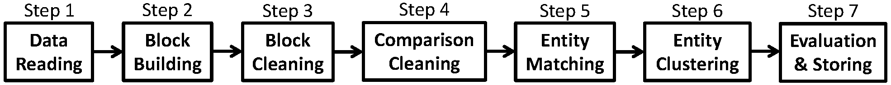

# Java gEneric DAta Integration (JedAI) Toolkit
JedAI constitutes an open source, high scalability toolkit that offers out-of-the-box solutions for any data integration task, e.g., Record Linkage, Entity Resolution and Link Discovery. At its core lies a set of *domain-independent*, *state-of-the-art* techniques that apply to both RDF and relational data. These techniques rely on an approximate, *schema-agnostic* functionality based on *(meta-)blocking* for high scalability. 

JedAI can be used in three different ways:

  1) As an **open source library** that implements numerous state-of-the-art methods for all steps of the end-to-end ER work presented in the figure below.
  2) As a **desktop application** with an intuitive Graphical User Interface that can be used by both expert and lay users.
  3) As a **workbench** that compares the relative performance of different (configurations of) ER workflows.

### Citation

If you use JedAI, please cite the following paper:

*George Papadakis, Leonidas Tsekouras, Emmanouil Thanos, George Giannakopoulos, Themis Palpanas and Manolis Koubarakis: "JedAI: The Force behind Entity Resolution", in ESWC 2017* ([pdf](documentation/jedaiDemoEswc17.pdf)).

## JedAI Workflow

JedAI implements a schema-agnostic, domain-independent end-to-end workflow for both Clean-Clean and Dirty ER that consists of 7 steps, as shown in the following image:

Below, we explain in more detail the purpose and the functionality of every step.

### Data Reading 
It transforms the input data into a list of entity profiles. An entity is a uniquely identified set of name-value pairs (e.g., an RDF resource with its URI as identifier and its set of predicates and objects as name-value pairs). 

The following formats are currently supported:
 1) CSV 
 2) RDF (any format, including XML, OWL)
 3) SQL (mySQL, PostgreSQL)
 
The next version will add support for more formats: SPARQL endpoints, JSON, MongoDB, Oracle and SQL Server.
  
### Block Building 
It clusters entities into blocks in a lazy manner that relies on unsupervised blocking keys: every token in an attribute value forms a key. Blocks are then extracted, possibly using a transformation, based on its equality or on its similarity with other keys.

The following methods are currently supported:
 1) Standard/Token Blocking
 2) Attribute Clustering
 3) Sorted Neighborhood
 4) Extended Sorted Neighborhood
 5) Q-Grams Blocking
 6) Extended Q-Grams Blocking
 7) Suffix Arrays Blocking
 8) Extended Suffix Arrays Blocking
  
For more details on the functionality of these methods, see [here](http://www.vldb.org/pvldb/vol9/p312-papadakis.pdf).  

### Block Cleaning
Its goal is to clean a set of blocks from unnecessary comparisons, which can be either *redundant* (i.e., repeated comparisons that have already been executed in a previously examined block) or *superfluous* (i.e., comparisons that involve non-matching entities). Its methods operate on the coarse level of entire blocks.

The following methods are currently supported:
 1) Size-based Block Purging
 2) Comparison-based Block Purging
 3) Block Scheduling
 4) Block Filtering
 
All methods are optional, but complementary with each other and can be used in combination. Note that all methods are compatible with Clean-Clean ER, but only the first three methods apply to Dirty ER. For more details on the functionality of these methods, see [here](http://www.vldb.org/pvldb/vol9/p684-papadakis.pdf).  

### Comparison Cleaning
Similar to Block Cleaning, this step aims to clean a set of blocks from both redundant and superfluous comparisons. Unlike Block Cleaning, its methods operate on the finer granularity of individual comparisons. 

The following methods are currently supported:
 1) Comparison Propagation
 2) Cardinality Edge Pruning (CEP)
 3) Cardinality Node Pruning (CNP)
 4) Weighed Edge Pruning (WEP)
 5) Weighed Node Pruning (WNP)
 6) Reciprocal Cardinality Node Pruning (ReCNP)
 7) Reciprocal Weighed Node Pruning (ReWNP)

Most of these methods are Meta-blocking techniques. All methods are optional, but competive, in the sense that only one of them can part of an ER workflow. For more details on the functionality of these methods, see [here](http://www.sciencedirect.com/science/article/pii/S2214579616300168).  

### Entity Matching
It compares pairs of entity profiles, associating every pair with a similarity in [0,1]. Its output comprises the *similarity graph*, i.e., an undirected, weighted graph where the nodes correspond to entities and the edges connect pairs of compared entities. 

The following schema-agnostic methods are currently supported:
1) [Group Linkage](http://pike.psu.edu/publications/icde07.pdf), 
2) Profile Matcher, which aggregates all attributes values in an individual entity into a textual representation.

Both methods can be combined with the following representation models.
 1) character n-grams (n=2, 3 or 4)
 2) character n-gram graphs (n=2, 3 or 4)
 3) token n-grams (n=1, 2 or 3)
 4) token n-gram graphs (n=1, 2 or 3)

For more details on the functionality of these bag and graph models, see [here](https://link.springer.com/article/10.1007%2Fs11280-015-0365-x).

The bag models can be combined with the following similarity measures, using both TF and TF-IDF weights: 
   1) ARCS similarity
   2) Cosine similarity 
   3) Jaccard similarity 
   4) Generalized Jaccard similarity 
   5) Enhanced Jaccard similarity
   
The graph models can be combined with the following graph similarity measures:
   1) Containment similarity 
   2) Normalized Value similarity 
   3) Value similarity 
   4) Overall Graph similarity

### Entity Clustering
It takes as input the similarity graph produced by Entity Matching and partitions it into a set of equivalence clusters, with every cluster corresponding to a distinct real-world object.

The following domain-independent methods are currently supported for Dirty ER:
1) Center Clustering
2) Connected Components Clustering
3) Cut Clustering
4) Markov Clustering
5) Merge-Center Clustering
6) Ricochet SR Clustering

For more details on the functionality of these methods, see [here](http://www.vldb.org/pvldb/2/vldb09-1025.pdf). 

For Clean-Clean ER, only one method is supported:
1) Unique Mapping Clustering

For more details on its functionality, see [here](https://arxiv.org/pdf/1207.4525.pdf).

### Consortium

JEDAI is a collaboration project involving the following partners:
* [Department of Informatics and Telecommunications, University of Athens](http://www.di.uoa.gr),
* [Software and Knowledge Engineering Lab, National Center for Scientific Research "Demokritos"](https://www.iit.demokritos.gr/skel) ,
* [Science-For-You not-for-profit company](http://www.scify.gr/site/en) 
* [LIPADE, Paris Descartes University](http://lipade.mi.parisdescartes.fr)
